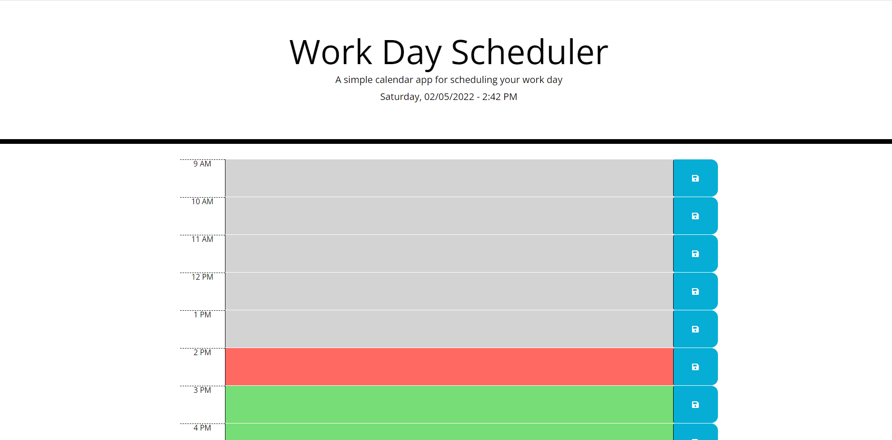

# Work Day Scheduler Starter Code

Create a simple calendar application that allows a user to save events for each hour of the day. This app will run in the browser and feature dynamically updated HTML and CSS powered by jQuery.

The starter code uses the Moment.js (Links to an external site.) library to work with date and time, but feel free to use a different JavaScript solution to handle this functionality since Moment.js is considered a "legacy" project. Learn more about some alternative solutions.

## User Story

```
AS AN employee with a busy schedule
I WANT to add important events to a daily planner
SO THAT I can manage my time effectively
```

## Acceptance Criteria

```
GIVEN I am using a daily planner to create a schedule
WHEN I open the planner
THEN the current day is displayed at the top of the calendar
WHEN I scroll down
THEN I am presented with time blocks for standard business hours
WHEN I view the time blocks for that day
THEN each time block is color-coded to indicate whether it is in the past, present, or future
WHEN I click into a time block
THEN I can enter an event
WHEN I click the save button for that time block
THEN the text for that event is saved in local storage
WHEN I refresh the page
THEN the saved events persist
```

The following picture shows the web application's appearance and functionality:



## Review

You are required to submit BOTH of the following for review:

* The URL of the deployed application.
https://christanfox.github.io/5.-Third-Party-APIs-Challenge-No-Time-to-Idle/
* The URL of the GitHub repository that contains your code. Give the repository a unique name and include a README file that describes the project.
https://github.com/ChristanFox/5.-Third-Party-APIs-Challenge-No-Time-to-Idle
- - -
© 2022 Trilogy Education Services, LLC, a 2U, Inc. brand. Confidential and Proprietary. All Rights Reserved.